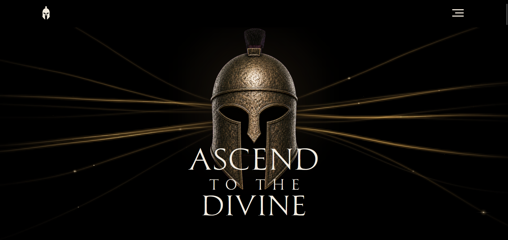

# [ApotheonAI]([https://apotheon-ai.vercel.app/)

**Live site:** [https://apotheon-ai.vercel.app/](https://apotheon-ai.vercel.app/)

ApotheonAI is a fictional enterprise AI security brand focused on helping organizations adopt AI with better **visibility, security, and governance**.

## Preview

## Why "ApotheonAI"?

The name was inspired by **Apotheon**, one of my favorite video games, which is set in Ancient Greek mythology and centers on ascending Mount Olympus and confronting the gods.

It also draws from **apotheosis**, the elevation of someone to divine status, or figuratively, the highest point or culmination of something.

For this fictional brand, that idea represents elevating AI toward a higher standard of security, trust, and maturity.

## What I Built

The project is a multi-page Astro site with reusable components, responsive layouts, animated navigation, and a Sanity-powered blog.

The completed project includes:

- reusable Astro components and layouts
- TypeScript for browser-side behavior
- Tailwind CSS for responsive styling
- Preline UI for selected interactive behavior
- GSAP for the header menu animation
- a Sanity headless CMS
- CMS-managed blog posts
- dynamic blog routes based on Sanity slugs
- reusable BlogCard components
- image metadata such as alternative text, credit, and source URLs
- responsive desktop, tablet, and mobile layouts

## Stack

- **Astro**
- **TypeScript**
- **Tailwind CSS**
- **Preline UI**
- **GSAP**
- **Sanity**

## What I Learned

This project gave me practical experience with Astro beyond building static pages.

### Astro and component structure

I learned how to separate page structure, reusable components, layouts, and browser-side scripts instead of putting everything into one component.

For example, the header keeps its markup in Astro while its scroll and menu behavior lives in TypeScript. That kept the component easier to read and avoided introducing React for behavior that did not need it.

### Astro versus React

One of the most useful decisions in this project was learning when not to use React.

Astro handles most of the site well on its own. Small interactions can use TypeScript and browser APIs, while React can be reserved for components that actually need client-side state or more application-like behavior.

### TypeScript in a frontend project

I used TypeScript for component props, CMS data, and browser-side scripts.

Working with Sanity made the value of keeping schemas, GROQ projections, TypeScript types, and component props in sync especially clear.

### Headless CMS integration

I added Sanity so blog content can be created and updated without editing Astro source files.

That involved:

- defining Author and Post schemas
- creating references between documents
- fetching content with GROQ
- passing CMS data into Astro components
- rendering blog listings and article routes
- handling optional content such as excerpts and images
- learning how a schema change also needs corresponding frontend query and type changes

### Responsive UI development

I spent a large part of the project refining layouts across desktop, tablet, and mobile sizes.

That included working on:

- hero layouts
- responsive typography
- card grids
- navigation behavior
- image sizing and cropping
- spacing at different breakpoints

I also learned that responsive work is often less about adding more breakpoints and more about choosing better layout constraints.

### Animation and interaction

The header menu was a useful exercise in interaction design.

I moved from simple CSS transitions to a GSAP-driven SVG animation so the hamburger-to-X transition could be controlled more precisely.

That also reinforced the importance of understanding stacking contexts, overlay timing, accessibility state, and how multiple libraries interact.

### Accessibility

I incorporated accessibility into component behavior instead of treating it as a final pass.

Examples include:

- semantic elements
- accessible navigation labels
- `aria-expanded` state
- keyboard focus styles
- alternative text for CMS-managed images
- reduced-motion considerations
- keeping interactive controls usable while overlays are open

### Keeping content separate from presentation

The blog helped reinforce the value of separating content from frontend code.

Authors can publish or update articles in Sanity while Astro remains responsible for presentation, routing, and layout.

### Typography

- **CaneNero**
- **Playfair Display**
- **Inter**

## Design

I designed the site in **Figma**, including the layout, typography, visual identity, component direction, and responsive UI.

The visual direction combines a modern enterprise interface with references to classical mythology.

The statue portrait used on the About page was created with [Face Your Fate](https://www.faceyourfate.app/en-us), which I found through Christopher Nolan's *The Odyssey* website.

P.S. Please watch The Odyssey as soon as you get the chance. It's by far the best experience I've ever had in a movie theatre!

## Blog and Headless CMS

The blog is powered by Sanity.

Posts can be created and published through Sanity Studio without editing frontend source files.

The Post model supports:

- title
- slug
- excerpt
- publication date
- author
- header image
- alternative text
- image credit
- image source URL
- rich article content

The frontend fetches this content with GROQ and renders it through Astro pages and components.

See [Blog Authoring](./docs/cms/blog-authoring.md) for the publishing workflow.

## Project Structure

The main application lives in `src/`.

Sanity Studio and CMS schemas live in `studio/`.

Project documentation lives in `docs/`.

## Documentation

- [Documentation Index](./docs/documentation.md)
- [Blog Authoring](./docs/cms/blog-authoring.md)
- [CMS Content Model](./docs/cms/content-model.md)
- [Local Setup](./docs/development/local-setup.md)
- [Architecture](./docs/development/architecture.md)

## Disclaimer

**ApotheonAI is a fictional company created solely as a portfolio and learning project.** It is not a real cybersecurity product or business.
